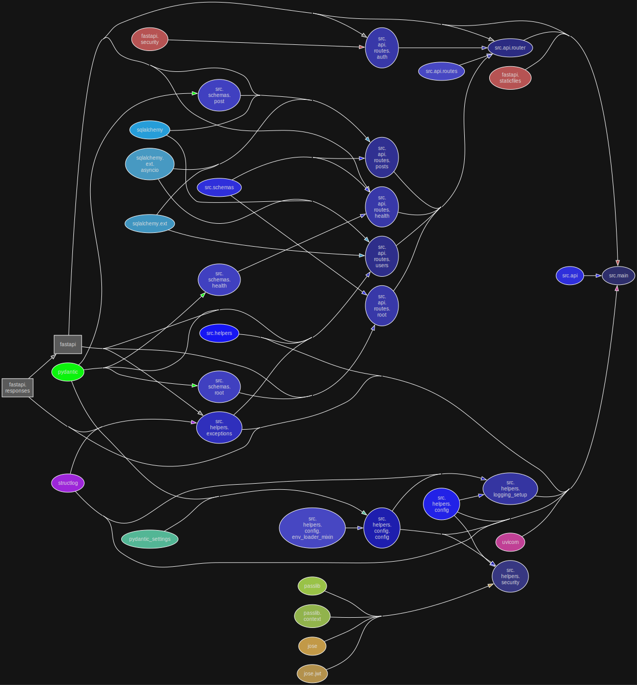
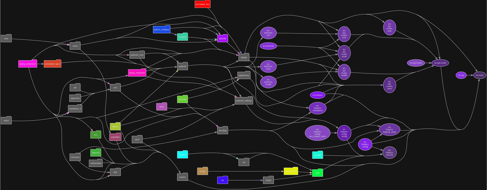
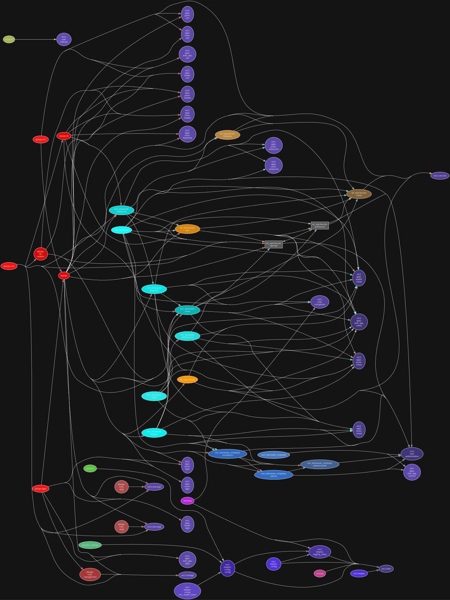
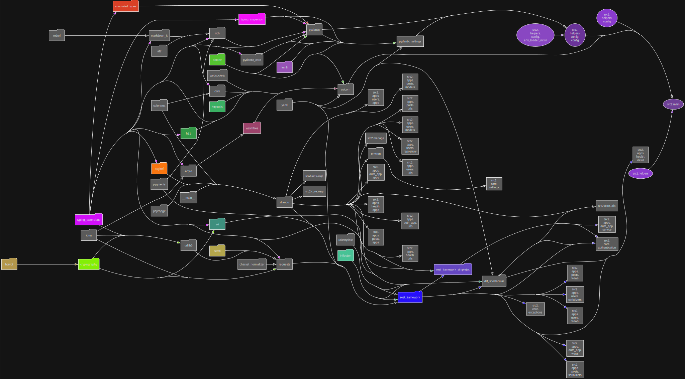

# Local kubernetes cluster

### Project structure diagrams

#### FastAPI project

##### Modular perspective

<p align="center">
  
</p>

##### Library dependencies perspective

<p align="center">
  
</p>

#### Django project

##### Modular perspective

<p align="center">
  
</p>

##### Library dependencies perspective

<p align="center">
  
</p>

## Requirements

- [UV](https://github.com/astral-sh/uv) package manager
- [Docker Desktop](https://docs.docker.com/desktop/install/windows-install/)
- [Vault](https://developer.hashicorp.com/vault/install)
- [Kind](https://kind.sigs.k8s.io/docs/user/quick-start/#installation)
- [Helm](https://helm.sh/docs/intro/install/)
- [Kustomize](https://kubectl.docs.kubernetes.io/installation/kustomize/)
- [Task](https://taskfile.dev/installation/)
- [Tilt](https://docs.tilt.dev/install.html)


## Local development (Windows PowerShell):

You can also use VSCode `settings.json` and `launch.json` files to run the project (choose interpreter created by UV).

## Native Windows development:

```commandline
task full-dev-native ; 
```

## Native GitOps:

```commandline
task full-gitops ; 
```

### Dev credentials:

Vault:
>Token: `root`

ArgoCD:
>login: `admin`

>password: `admin123`